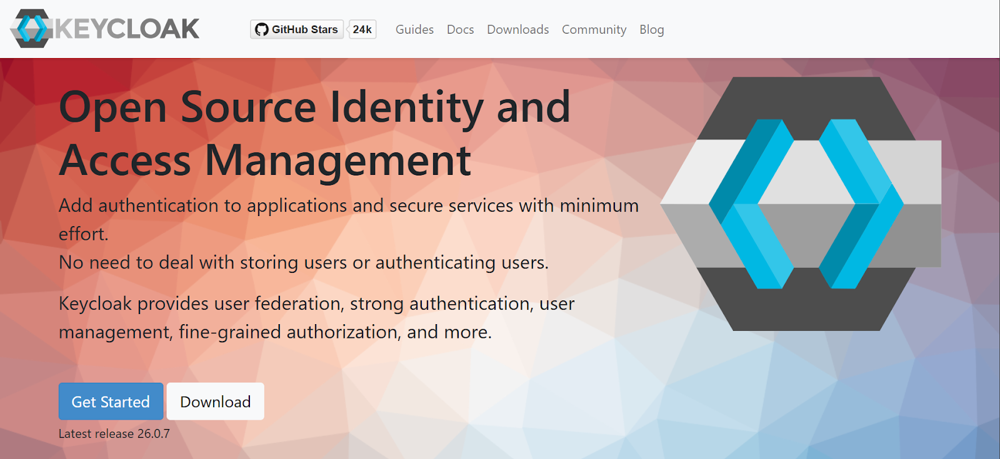
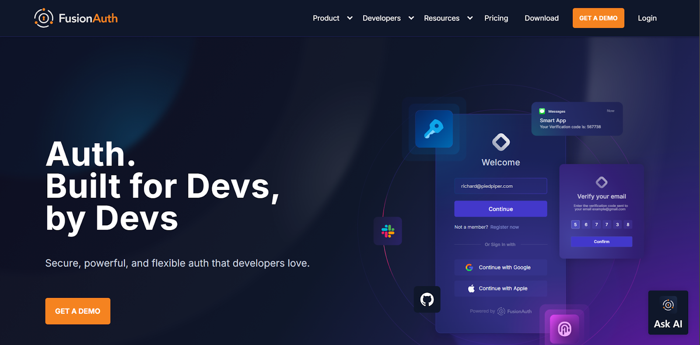
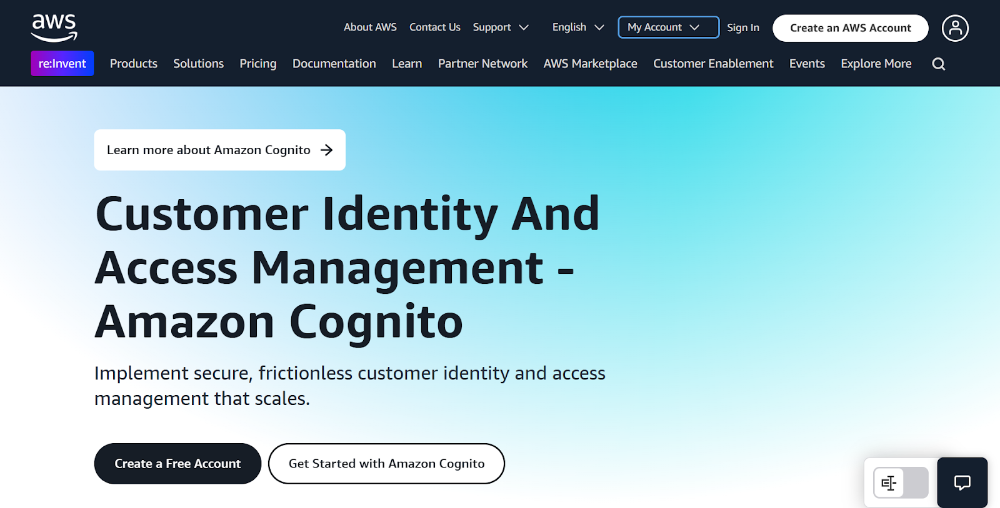
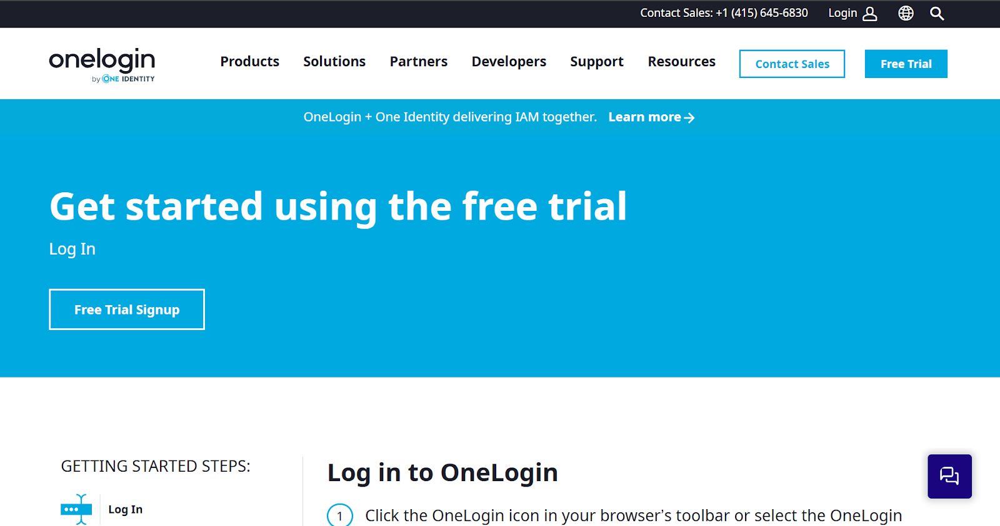

# Table of Contents

- [1. Supertokens](#1-supertokens)
- [2. Keycloak](#2-keycloak)
- [3. Okta](#3-okta)
- [4. FusionAuth](#4-fusionauth)
- [5. Auth0](#5-auth0)
- [6. Cognito](#6-cognito)
- [7. OneLogin](#7-onelogin)
- [What to Look For in an Authentik Alternative](#what-to-look-for-in-an-authentik-alternative)
- [Conclusion](#conclusion)

As organizations increasingly prioritize secure and efficient identity
management, the demand for reliable alternatives to Authentik---a
popular open-source identity and access management (IAM)
solution---continues to grow. While Authentik has carved out a niche for
itself with its versatile features, community discussions reveal common
user concerns that must be addressed. These include better
documentation, a more intuitive user interface (UI), and additional
functionalities such as bypassing, proxying, and seamless third-party
integrations.

In this comprehensive guide, we will explore seven robust Authentik
alternatives, focusing on their key features, pricing structures,
limitations, and how they address the pain points expressed by users.

# **1. Supertokens**

## **Key Features:**

-   **Social Login Support:** Supertokens allows users to authenticate using popular social media accounts like Google and Facebook,simplifying the login process.

-   **Advanced Session Management:** The platform offers robust session management capabilities that include anti-CSRF protection and JSON Web Tokens (JWT) for enhanced security.

-   **Customizable Authentication Flows:** Organizations can tailor authentication processes to meet their specific requirements, providing a personalized experience for users.

-   **Managed and Self-hosted Options:** Supertokens offers both [self-hosted](https://supertokens.com/blog/self-hosted-authentication) and managed hosting solutions, allowing organizations to choose the deployment method that best suits their needs.

# **Pricing:**

-   Free for self-hosted deployments.

-   Managed hosting is free for up to 5,000 Monthly Active Users (MAUs), with costs starting at \$0.02 per user per month beyond that threshold.

-   Additional advanced features, including MFA and multitenancy, are available as paid add-ons.

## **Limitations:**

-   While SuperTokens offers essential IAM features, it may lack some advanced capabilities found in larger competitors like Okta, which provides extensive pre-built integrations and adaptive authentication, and Keycloak, which excels in flexibility and customization for complex environments.

-   Customization requires a certain level of developer expertise, which may pose a challenge for teams without technical resources.

Supertokens is one of the top Authentik competitors due to its seamless
integration and scalability. These features address common concerns
about migrating to a new system and scaling as business needs evolve.
Organizations looking for a straightforward yet powerful IAM solution
will find Supertokens particularly appealing.

Additionally, Supertokens offers passwordless authentication through
[email magic links](https://supertokens.com/features/email-magic-links).
This method enhances security while improving user conversion rates by
eliminating the need for passwords.

# **2. Keycloak**

## **Key Features:**

-   **Single Sign-On (SSO):** Keycloak provides SSO functionality that allows users to log in once and gain access to multiple applications without repeated authentication.

-   **Multi-Factor Authentication (MFA):** Enhances security by requiring additional verification methods beyond just passwords.

-   **LDAP and Active Directory Integration:** Seamlessly integrates with existing directory services, making it easier for organizations to manage user identities.

-   **Customizable Through Plugins:** Keycloak supports various plugins and adapters, allowing organizations to extend its functionality as needed.

## **Pricing:**

-   Keycloak is free and open-source, making it an attractive option for budget-conscious organizations.

## **Limitations:**

-   The setup process can be complex, particularly for smaller teams or those without dedicated IT resources.

-   It can be resource-intensive when deployed at scale, potentially leading to performance issues if not managed properly.

Keycloak is an excellent choice for organizations looking for a robust
open-source IAM solution that offers extensive customization options.
However, teams should be prepared for the initial complexity of setup
and maintenance. For more on the types of authentication methods
available today, see our article on [Types of Authentication](https://supertokens.com/blog/types-of-authentication).

# **3. Okta**

## **Key Features:**

-   **Cloud-Native Scalability:** Okta is designed to scale effortlessly with your organization's growth.

-   **SSO, MFA, and Passwordless Authentication Options:** Provides comprehensive security features that enhance user experience while maintaining high-security standards.

-   **Extensive Prebuilt Integrations:** Okta boasts many prebuilt integrations with popular applications and services.

-   **Advanced Compliance Tools:** Helps organizations meet regulatory requirements through built-in compliance features.

## **Pricing:**

-   Okta employs premium pricing tailored primarily for enterprise customers.

## **Limitations:**

-   The cost can become prohibitive as user numbers grow, particularly for smaller organizations or startups.

-   Additional costs may apply for advanced features or integrations beyond the basic offering.

Okta is ideal for enterprises seeking a cloud-native solution with
extensive features. However, potential customers should carefully
evaluate their budget against Okta\'s pricing structure.

# **4. FusionAuth**

## **Key Features:**

-   **Full Control Over Authentication Workflows:** FusionAuth allows developers to design custom authentication flows tailored to their applications\' needs.

-   **SSO, MFA, and Passwordless Login Support:** Offers a range of authentication methods to enhance security.

-   **Self-hosted or Cloud Deployment Options:** Flexibility in deployment allows organizations to choose between self-hosting or utilizing FusionAuth's cloud services.

-   **Extensive Developer-Focused APIs:** Provides robust APIs that facilitate integration with existing systems.

## **Pricing:**

-   FusionAuth offers a free tier with basic features; paid versions unlock advanced capabilities.

## **Limitations:**

-   While FusionAuth is feature-rich, it may not be as enterprise-ready as some competitors.

-   Certain advanced features may require manual configuration, which could pose challenges for less technical teams.

FusionAuth is particularly appealing to developers looking for
flexibility in authentication workflows. Its extensive APIs make it easy
to integrate into existing systems while providing essential security
features. For insights into the benefits of multi-factor authentication,
check out our article on [Benefits of Multi-Factor Authentication](https://supertokens.com/blog/benefits-of-multi-factor-authentication).

# **5. Auth0**

## **Key Features:**

-   **Easy-to-integrate SDKs and APIs:** Auth0 provides developers with tools that simplify integration into various applications.

-   **SSO, MFA, and Social Logins Support:** Offers comprehensive authentication options that cater to diverse user preferences.

-   **Cloud-Based Scalability:** Designed to scale with your organization's needs without significant infrastructure overhead.

-   **Extensive App Integrations:** Supports integration with numerous third-party applications out of the box.

## **Pricing:**

-   Auth0 offers a free tier with usage limits; paid plans provide additional features tailored to larger organizations.

## **Limitations:**

-   Costs can escalate significantly as user numbers grow or if additional features are required.

-   Reliance on cloud infrastructure may not suit all organizations' needs or preferences.

Auth0 is an excellent choice for teams seeking ease of integration with
strong support for modern authentication methods. However, users should
be mindful of potential cost increases as they scale their operations.

# **6. Cognito**

## **Key Features:**

-   **Managed by AWS:** Cognito integrates seamlessly with other AWS services, making it an attractive option for organizations already using AWS infrastructure.

-   **Social Login and SAML Support:** Provides flexibility in authentication methods while supporting industry standards like SAML.

-   **Scalable Solution for Global Applications:** Designed to handle large-scale deployments effectively.

-   **Built-in User Directory:** Simplifies user management by providing a centralized directory service.

## **Pricing:**

-   The free tier is available for up to 50,000 MAUs; paid plans are based on usage beyond this limit.

## **Limitations:**

-   Dependency on AWS may limit flexibility compared to standalone IAM solutions.

-   Some users find Cognito less customizable than other options on this list.

Cognito is particularly well-suited for organizations already invested
in the AWS ecosystem. Its scalability makes it an attractive option for
global applications; however, potential customers should consider their
reliance on AWS when evaluating this solution.

# **7. OneLogin**

## **Key Features:**

-   **SSO and MFA Support:** Offers robust security features that enhance user experience while maintaining stringent access controls.

-   **Directory Integration (LDAP/AD):** Facilitates seamless integration with existing directory services like LDAP or Active Directory.

-   **Automated User Provisioning Capabilities:** Streamlines user management processes by automating provisioning tasks.

-   **Cloud-based and Highly Secure:** OneLogin\'s architecture leverages cloud technology to enhance security while simplifying user management processes, ensuring that sensitive data is protected through advanced security measures.

## **Pricing:**

-   Paid plans start at \$4/user/month.

-   Additional features are available at varying prices.

## **Limitations:**

-   Costs can be higher than some alternatives, which may deter smaller teams or startups from adopting OneLogin.

-   Limited options for self-hosted deployments compared to other IAM solutions on this list.

OneLogin is an excellent choice for organizations prioritizing security
through SSO and MFA while needing seamless integration with existing
directory services. However, potential users should carefully evaluate
their budget against OneLogin\'s pricing structure before committing.

# **What to Look For in an Authentik Alternative**

## **Scalability**

Scalability is a critical factor when selecting an identity management
solution. As your organization grows, the chosen solution must be able
to accommodate an expanding user base without compromising performance.
This means that the system should efficiently handle increased
authentication requests and maintain fast response times.

-   **User Base Growth:** Consider whether the alternative can support a growing number of users, especially if you anticipate rapid growth or seasonal spikes in activity.

-   **Performance Metrics:** Look for solutions that provide performance benchmarks or case studies demonstrating their ability to scale effectively in real-world scenarios.

-   **Load Balancing and Redundancy:** Evaluate whether the solution includes features such as load balancing and redundancy to ensure high availability and reliability during peak usage times.

## **Strong Security Features**

Security is paramount in any identity management solution. Look for
alternatives that offer robust security measures to protect sensitive
data and ensure secure access for users.

-   **Single Sign-On (SSO):** SSO allows users to log in once and access multiple applications without needing to re-enter credentials, enhancing user experience while maintaining security.

-   **Multi-Factor Authentication (MFA):** MFA adds an extra layer of security by requiring users to provide two or more verification factors to gain access, significantly reducing the risk of unauthorized access.

-   **Passwordless Authentication Options:** Solutions that offer passwordless authentication methods (such as biometrics or magic links) can enhance security and improve user convenience.

-   **Compliance with Standards:** Ensure that the alternative complies with industry standards and regulations (e.g., GDPR, HIPAA) relevant to your organization.

## **Integration Capabilities**

The ability of an identity management solution to integrate seamlessly
with existing tools and applications is crucial for minimizing
disruption during implementation.

-   **Compatibility with Existing Systems:** Assess how well the alternative integrates with your current software stack, including customer relationship management (CRM) systems, enterprise resource planning (ERP) systems, and other critical applications.

-   **APIs and SDKs:** Look for solutions that provide robust APIs and software development kits (SDKs) that facilitate easy integration into your applications.

-   **Pre-built Connectors:** Some solutions offer pre-built connectors for popular applications, which can significantly reduce implementation time and complexity.

## **Flexible Deployment Options**

Organizations have different preferences regarding how they deploy their
identity management solutions. Consider whether you prefer a self-hosted
option or a cloud-based service.

-   **Self-hosted Solutions:** These allow organizations to maintain complete control over their data and infrastructure. This option is often preferred by organizations with strict compliance requirements or those wanting greater customization.

-   **Cloud-based Services:** Cloud solutions can offer scalability and reduced maintenance overhead but may raise concerns about data security and compliance. Evaluate whether the provider meets your security requirements.

-   **Hybrid Models:** Some alternatives may offer hybrid deployment options, allowing organizations to leverage both cloud and on-premises resources based on their specific needs.

## **Cost-effectiveness**

Analyzing the pricing structure of each alternative against your
budgetary constraints is essential for ensuring long-term
sustainability.

-   **Transparent Pricing Models:** Look for solutions with clear pricing structures that outline costs associated with various features, user tiers, and additional services.

-   **Hidden Costs:** Be wary of potential hidden costs related to scaling up (such as increased fees per user) or adding advanced features later on in your usage of the platform.

-   **Total Cost of Ownership (TCO):** Consider not only the initial costs but also ongoing operational expenses, including maintenance, support, and training costs over time.

## **Community Support and Documentation**

An active community and comprehensive documentation can greatly enhance
your experience with an identity management solution.

-   **Community Engagement:** A strong community presence can provide valuable resources such as forums, tutorials, and shared experiences that can aid in troubleshooting and best practices.

-   **Quality of Documentation:** Well-organized documentation can make a significant difference in the implementation process. Look for detailed guides on setup, configuration, troubleshooting, and integration processes.

# **Conclusion**

Selecting the right alternative to Authentik requires careful
consideration of your organization's unique needs regarding scalability,
security features, integration capabilities, deployment preferences, and
budget constraints. Each of the solutions outlined above offers distinct
advantages that cater to various aspects of identity management while
addressing common user concerns such as documentation quality and UI
usability.

Looking for a powerful Authentik alternative? Discover SuperTokens\'
advanced features for secure and scalable identity management. Try
[SuperTokens](https://supertokens.com/product) today!

**For external references on identity management trends:**

1.  [Alternatives to Authentik](https://alternativeto.net/software/authentik/) - A comprehensive list of IAM tools available today.

2.  [User Pain Points in UX](https://www.ramotion.com/blog/user-pain-points/) - Insights into common UX issues affecting users today that could inform your choice of IAM solutions.

By carefully evaluating these Authentik competitors against your
organization's specific requirements, you can make an informed decision
that enhances your identity management strategy while addressing
community concerns effectively.
